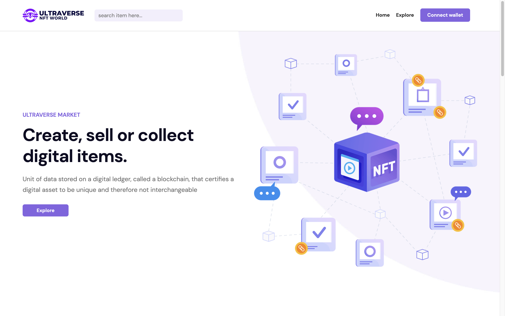
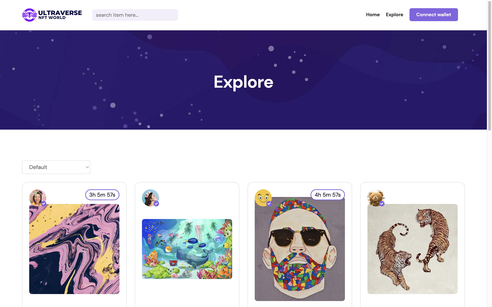
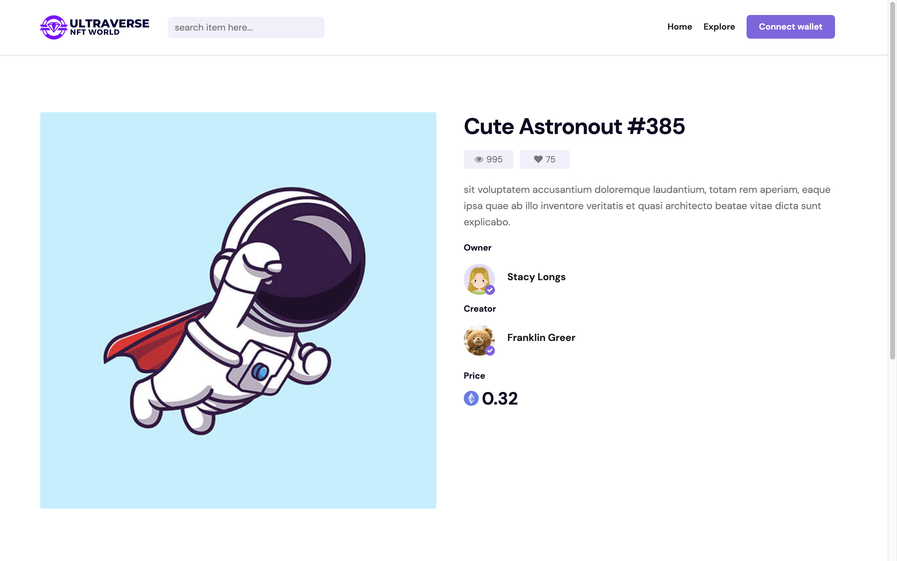

# NFT Marketplace

This is a React-based NFT marketplace that fetches NFTs from a cloud API and dynamically displays them with their data.

## Technologies Used

- React
- CSS
- AOS for animations
- Owl Carousel library for carousel

## How to Run the Project

1. Clone the repository to your local machine.
2. Run `npm install` in the terminal to install the necessary dependencies.
3. Run `npm start` to start the development server.
4. Open your browser and navigate to `http://localhost:3000` to view the app.

## Features

- Fetches NFT data from a cloud API.
- Dynamically displays NFTs with their data.
- Smooth animations with AOS.
- Carousel component to showcase NFTs.

## Contributing

If you'd like to contribute to this project, feel free to fork the repository and create a pull request with your changes.

## License

This project is licensed under the [MIT License](https://opensource.org/licenses/MIT).
